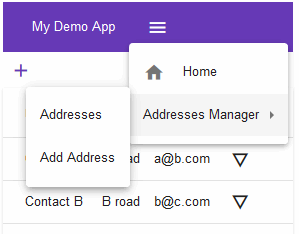
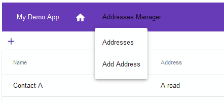

In this section we will be adding
 * Header
 * Footer
 * Menu

Then we will connect the application to a "real" rest api, using the material DataSource and finally a basic authentication

 * [Installation](#l001)
 * [Header and footer](#l002)
 * [Toolbar](#l003)
 * [Adding the submenu](#l004)
 * [Using a real REST Api](#l005)

The rest:

 * [Setup](README.md)
 * [Chapter 1: Basic addressbook app](demo001mat.md)
 * [Chapter 2 preparation: Rest API with express](demo002srv.md)

##  Installation

Copy the project demo001mat to demo002mat

##  Header and footer

First generate the stubs for the components

	ng generate component header
	ng generate component footer

And we can then modify the app.component.html file to include them. It will become like

	<link href="https://fonts.googleapis.com/icon?family=Material+Icons"
	      rel="stylesheet">
	<app-header></app-header>
	<router-outlet></router-outlet>
	<app-footer></app-footer>

And starting the app with "ng serve" the new parts will magically appear inside the view! Note that the path for the two modules is src/**app**/**footer** and we are using the name "app-footer" and "app-header" to use them!

Navigating through the app will always show them

##  Toolbar

### Global configuration

First we will import a bunch of modules to app.module.ts. This are for the toolbar, the menu to show when the view is narrow and the animation to show the menu and submenus, and the flex layout to adapt to view

	import { MatToolbarModule } from '@angular/material/toolbar';
	import { MatMenuModule } from '@angular/material/menu';
	import { BrowserAnimationsModule } from '@angular/platform-browser/animations';
	import { FlexLayoutModule } from '@angular/flex-layout';

And
	  imports: [
	    ...
	    MatToolbarModule,
	    MatMenuModule,
	    BrowserAnimationsModule,
		FlexLayoutModule,
	  ],

Inside the global style.less we then add a theme for angular material

	@import "~@angular/material/prebuilt-themes/deeppurple-amber.css";

### Inside the header

Adding the title to show for the application 

	export class HeaderComponent implements OnInit {
	  title:string = "My Demo App";

Then we can finally add the menus. First with the simple "home" button and the application title. Notice the mat-menu inside the mat-toolbar. This is to show the menu when the toolbar is narrowed.

We even assign a name to the matMenu to use it later "#menu".

	<mat-toolbar color="primary">
		<button mat-button routerLink="/">{{title}}</button>
		

			<button mat-button routerLink="/"><mat-icon>home</mat-icon></button>			
		

		<button mat-button [mat-menu-trigger-for]="menu" fxHide="false" fxHide.gt-sm><mat-icon>menu</mat-icon></button>
		<mat-menu x-position="before" #menu="matMenu">
			<button mat-menu-item routerLink="/"><mat-icon>home</mat-icon> Home</button>
		</mat-menu>
	</mat-toolbar>

##  Adding the submenu

Now i want to add a section for the addresses that contains the list of addresses and the addition of a new one. Various things had been added.

	<mat-toolbar color="primary">
		<button mat-button routerLink="/">{{title}}</button>
		

			<button mat-button routerLink="/"><mat-icon>home</mat-icon></button>
			<button mat-menu-item [matMenuTriggerFor]="addresses">Addresses Manager</button>
			<mat-menu #addresses="matMenu">
				<button mat-menu-item routerLink="/address"> Addresses</button>
				<button mat-menu-item routerLink="/address/-1">Add Address</button>
			</mat-menu>
		

		<button mat-button [mat-menu-trigger-for]="menu" fxHide="false" fxHide.gt-sm><mat-icon>menu</mat-icon></button>
		<mat-menu x-position="before" #menu="matMenu">
			<button mat-menu-item routerLink="/"><mat-icon>home</mat-icon> Home</button>
				<button mat-menu-item [matMenuTriggerFor]="addressesMenu" >Addresses Manager</button>
				<mat-menu #addressesMenu="matMenu">
					<button mat-menu-item routerLink="/address"> Addresses</button>
					<button mat-menu-item routerLink="/address/-1">Add Address</button>
				</mat-menu>
		</mat-menu>
	</mat-toolbar>

A new button "Addresses Manager is added inside the mat toolbar, the button before it has the **matMenuTriggerFor** attribute set, and refers to the following mat-menu, named **addresses**

The same happens inside the "main" mat menu

The result is the following when collapsed

Or when expanded

##  Using a real REST Api

Before this step you should follow the [2 part preparation](demo002srv.md)

Should import the http client inside the app.module

	import { HttpClientModule } from '@angular/common/http';

Adding it to the imports

	  imports: [
	    ...
	    HttpClientModule,
	  ],

Now we modify the data service adding the dependency from httpClient (of course importing HttpClient) and a variable with the base url for the api

	import { HttpClient } from '@angular/common/http';
	...
		baseUrl:string = 'http://localhost:4201/api/address';
		constructor(private http: HttpClient) { } 

Let's start with the getAddresses